```{r setup, include=FALSE}
knitr::opts_chunk$set(echo = FALSE,
                      dpi = 300,
                      warning = F,
                      message = F)
library(rio)
library(tidyverse)
library(magrittr)
library(Momocs)
library(fuzzyjoin)
library(vegan)
library(igraph)
library(ggnetwork)
library(ggthemes)
library(multinet)
sessioninfo::session_info()

set.seed(1010)
```

## Social relations and arrow heads

::: {.columns}
::: {.column}

```{r}
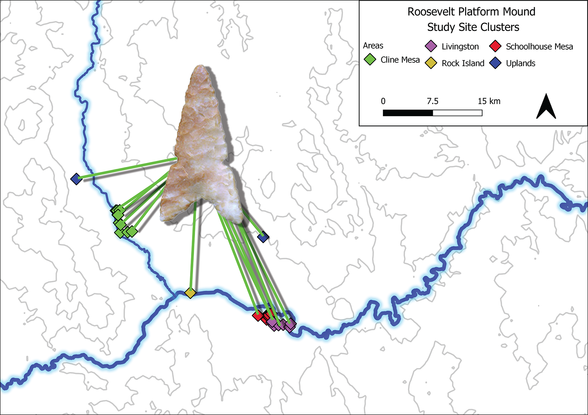
```


:::

::: {.column}
- Projectile points are an under-studied aspect of material culture in the Hohokam Classic period
- This study uses geometric morphometrics, clustering, and network methods to study patterns of projectile point outline similarity among Tonto Basin sites
- Projectile points are also compared to ceramics,  site type (architectural or other feature defining the site), and spatial distance
:::
:::


## Tonto Basin and the Roosevelt Platform Mound Study

::: {.columns}
::: {.column}

```{r fig.cap="The Roosevelt Platform Mound Study (RPMS) was one of several CRM projects conducted during the 1990s around the Roosevelt Reservoir [@Rice1998-ku]"}
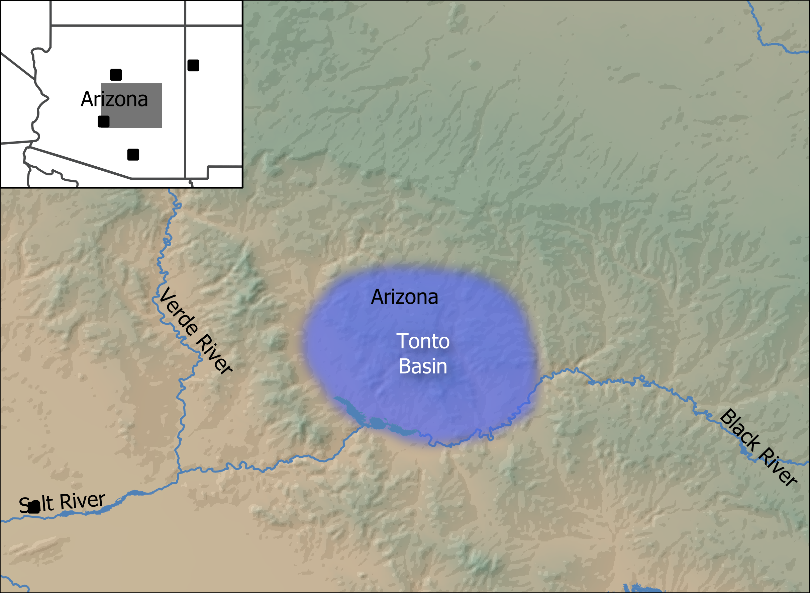
```


:::

::: {.column}

```{r fig.cap="The sites are divided into five clusters, and the heaviest occupation occurred during the Roosevelt phase (AD 1275-1325)"}
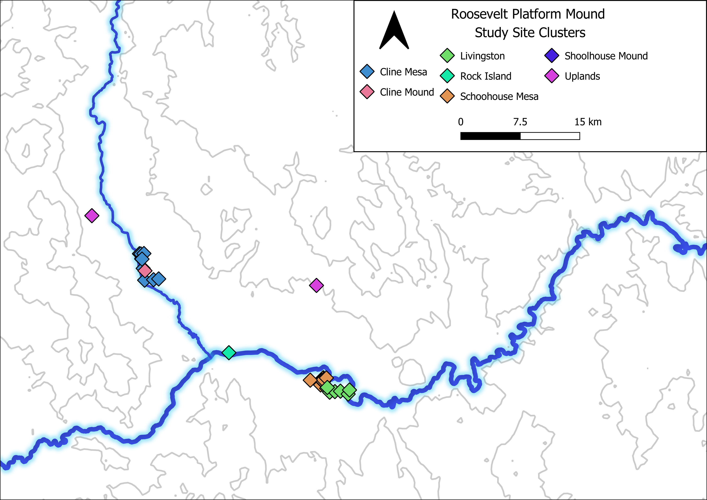
```
:::
:::


## Dataset

```{r}
sites = import("sites.xlsx",setclass = 'tibble')

knitr::kable(sites %>% select(name = ArchaMapName,area = Area, phase = Phase, ceramics = Ceramics, points = Points, architecture) %>% arrange(area,name,phase))
```

## Projectile point typologies

::: {.columns}
::: {.column}

```{r}
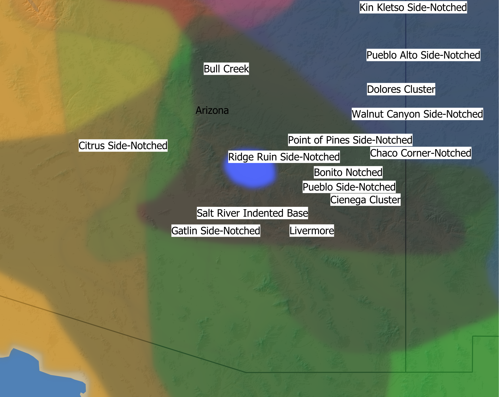
```


:::

::: {.column}
- One of the reasons regional projectile point studies are challenging is the difficulty harmonizing typologies
- The RPMS project decided to create two idiosyncratic typologies for their report [@Rice1994-rk]
- Justice [-@Justice2002-cf] has numerous overlapping types as shown in this figure
- Sliva [-@Sliva2006-nq] also describes a number of point types that would fit the points in this study

:::
:::

## Elliptical Fourier Analysis (EFA)--illustration from [@Caple2017-mk]

::: {.columns}
::: {.column}
```{r fig.cap = "EFA with 3 harmonics"}
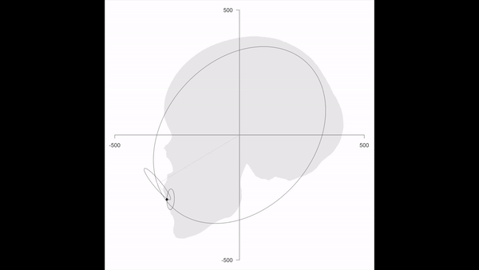
```
:::

::: {.column}
```{r fig.cap = "EFA with 40 harmonics"}
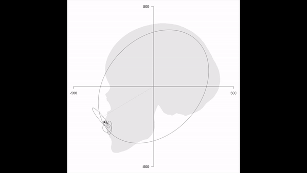
```
:::
:::

## Tonto points

::: {.columns}
::: {.column}

```{r}
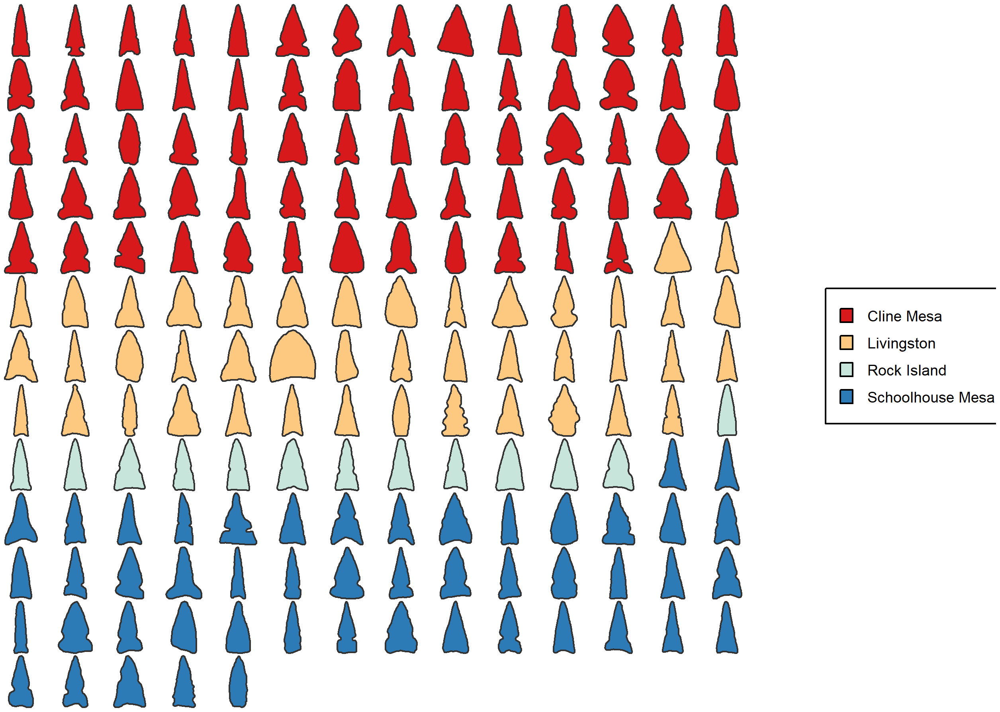
```


:::

::: {.column}
- Each projectile point was scanned with a flatbed scanner and the outline was extracted and imported into R [@R_Core_Team2022-wb] using the Momocs package [@Bonhomme2014-gt], which was also used for all geometric morphometric (GM) analysis
- Points were flipped horizontally so the greatest area was on the right side to reduce orientation bias
- 12 harmonics were used and 8 principal components (95% of variation) were kept 

:::
:::


## Projectile point clustering

::: {.columns}
::: {.column}

```{r fig.cap="Additional points from [@Bischoff2021-zn], [@Justice2002-cf],   and from the Cibola Archaeological Research Project [@noauthor_undated-ro]"}
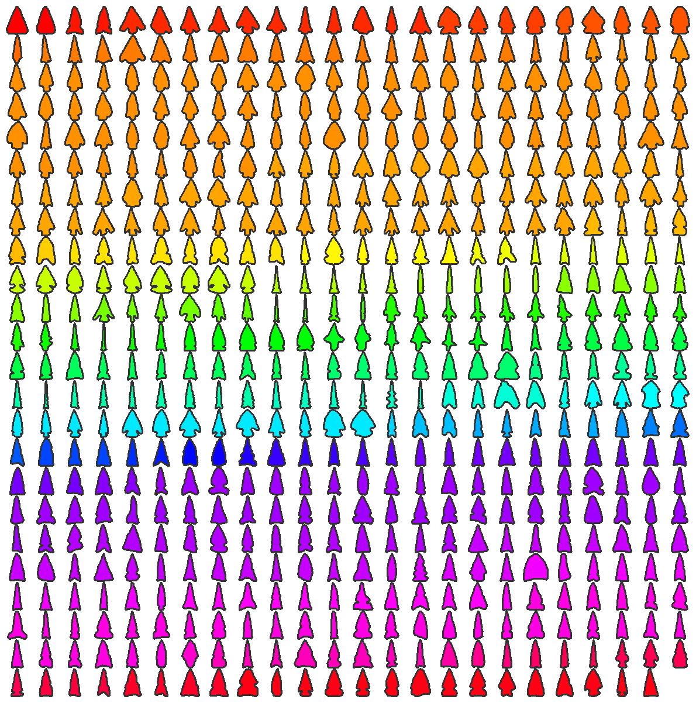
```


:::

::: {.column}

```{r}
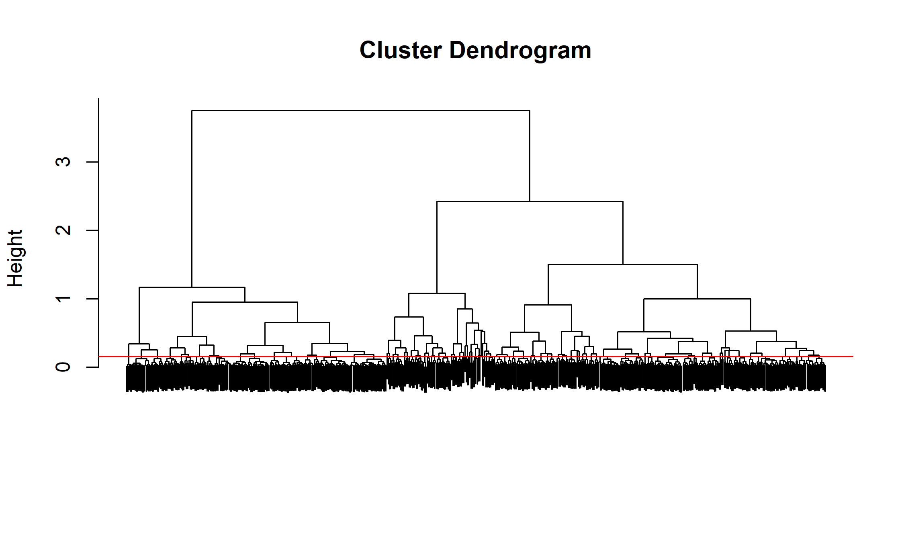
```

:::
:::

## Projectile point clustering


```{r}
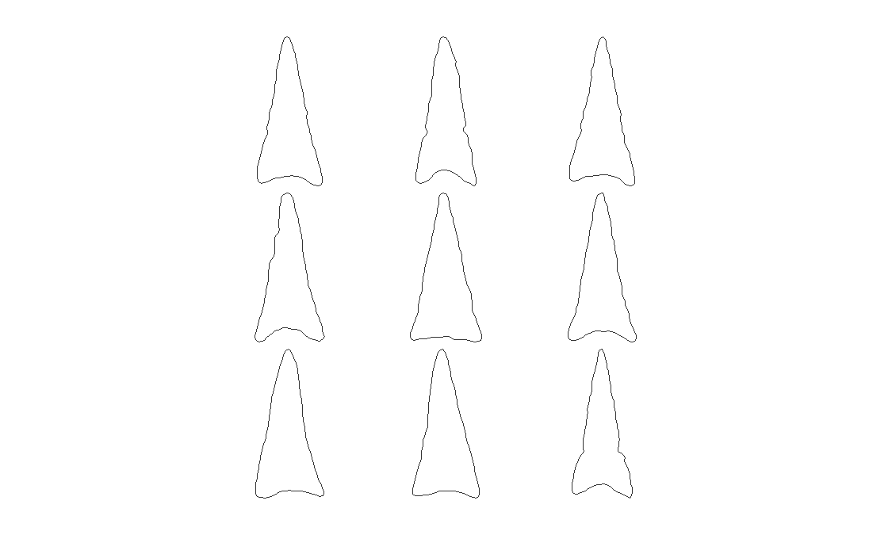
```


# Network layers

```{r}
sites = import("sites.xlsx",setclass='tibble')
netData = import('multilayernetworkWide.xlsx',setclass='tibble')

layers = netData %>% dplyr::select(any_of(contains("rank"))) %>% names %>%
  str_remove_all('rank_')
netList = map(layers,function(c){
  col = paste0("rank_",c)
  tmp = netData %>%
    select(from,to,all_of(col)) %>%
    filter(!!as.name(col) <=3)
  g = graph_from_data_frame(d = tmp, directed = T, vertices = sites)
  E(g)$weight = tmp[[col]]
  return(g)
}) %>%
  set_names(layers)
```


## Spatial

```{r}
plotdf = ggnetwork(netList$spatial) %>%
  as_tibble() %>%
  mutate(
    `primary site type` = case_when(
      str_detect(architecture, "mound") ~ "platform mound",
      str_detect(architecture, "roomblock") ~ "roomblock",
      str_detect(architecture, "compound") ~ "compound",
      TRUE ~ "other"
    )) %>% 
  mutate_if(is.character,factor)
colVals = RColorBrewer::brewer.pal(n =
  nlevels(plotdf$Area),name = "Accent") %>%
  set_names(levels(plotdf$Area))
plotdf %>%
  ggplot(aes(x = x, y = y, xend = xend, yend = yend, color = Area, shape = `primary site type`)) +
  geom_edges(color = "lightgray") +
  geom_point(size = 6) +
  scale_fill_manual(values = colVals) +
  theme_blank()
```

## Architecture

```{r}
plotdf = ggnetwork(netList$architecture) %>%
  as_tibble() %>%
  mutate(
    `primary site type` = case_when(
      str_detect(architecture, "mound") ~ "platform mound",
      str_detect(architecture, "roomblock") ~ "roomblock",
      str_detect(architecture, "compound") ~ "compound",
      TRUE ~ "other"
    )) %>% 
  mutate_if(is.character,factor)
colVals = RColorBrewer::brewer.pal(n =
  nlevels(plotdf$Area),name = "Accent") %>%
  set_names(levels(plotdf$Area))
plotdf %>%
  ggplot(aes(x = x, y = y, xend = xend, yend = yend, color = Area, shape = `primary site type`)) +
  geom_edges(color = "lightgray") +
  geom_point(size = 6) +
  scale_fill_manual(values = colVals) +
  theme_blank()
```

## Points

```{r}
plotdf = ggnetwork(netList$points) %>%
  as_tibble() %>%
  mutate(
    `primary site type` = case_when(
      str_detect(architecture, "mound") ~ "platform mound",
      str_detect(architecture, "roomblock") ~ "roomblock",
      str_detect(architecture, "compound") ~ "compound",
      TRUE ~ "other"
    )) %>% 
  mutate_if(is.character,factor)
colVals = RColorBrewer::brewer.pal(n =
  nlevels(plotdf$Area),name = "Accent") %>%
  set_names(levels(plotdf$Area))
plotdf %>%
  ggplot(aes(x = x, y = y, xend = xend, yend = yend, color = Area, shape = `primary site type`)) +
  geom_edges(color = "lightgray") +
  geom_point(size = 6) +
  scale_fill_manual(values = colVals) +
  theme_blank()
```

## Ceramics

```{r}
plotdf = ggnetwork(netList$ceramics) %>%
  as_tibble() %>%
  mutate(
    `primary site type` = case_when(
      str_detect(architecture, "mound") ~ "platform mound",
      str_detect(architecture, "roomblock") ~ "roomblock",
      str_detect(architecture, "compound") ~ "compound",
      TRUE ~ "other"
    )) %>% 
  mutate_if(is.character,factor)
colVals = RColorBrewer::brewer.pal(n =
  nlevels(plotdf$Area),name = "Accent") %>%
  set_names(levels(plotdf$Area))
plotdf %>%
  ggplot(aes(x = x, y = y, xend = xend, yend = yend, color = Area, shape = `primary site type`)) +
  geom_edges(color = "lightgray") +
  geom_point(size = 6) +
  scale_fill_manual(values = colVals) +
  theme_blank()
```

## Combined

```{r}
plotdf = ggnetwork(netList$combined) %>%
  as_tibble() %>%
  mutate(
    `primary site type` = case_when(
      str_detect(architecture, "mound") ~ "platform mound",
      str_detect(architecture, "roomblock") ~ "roomblock",
      str_detect(architecture, "compound") ~ "compound",
      TRUE ~ "other"
    )) %>% 
  mutate_if(is.character,factor)
colVals = RColorBrewer::brewer.pal(n =
  nlevels(plotdf$Area),name = "Accent") %>%
  set_names(levels(plotdf$Area))
plotdf %>%
  ggplot(aes(x = x, y = y, xend = xend, yend = yend, color = Area, shape = `primary site type`)) +
  geom_edges(color = "lightgray") +
  geom_point(size = 6) +
  scale_fill_manual(values = colVals) +
  theme_blank()
```

## Multilayer networks

```{r}
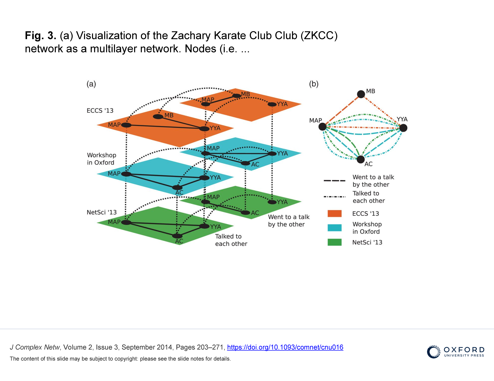
```

## Multilayer networks

```{r fig.cap="Made using the multinet package [@Magnani2021-jk]"}
net = ml_empty("Tonto")
for(i in 1:5){
  add_igraph_layer_ml(n = net, g = netList[[i]],name = layers[i])
}

nodesML = tibble(ArchaMapName = vertices_ml(net)[[1]]) %>%
  left_join(sites)

# plot

attrVal = nodesML$Area %>% factor
colPal = brewer.pal(length(levels(attrVal)),"Set1")
vertexCols = colPal[attrVal]

# par(mar=c(0,0,0,0))
# plot(net, vertex.labels = "", edge.type = 1, edge.width = 1, edge.col = 'blue', edge.alpha=.5, mai = c(.05,.05,.05,.25), vertex.color = vertexCols,grid = c(2,3),edge.arrow.length = 0, edge.arrow.angle = 0)
# legend("bottomright", legend=levels(attrVal), col = colPal,bty = "n",
#        pch = 20, pt.cex = 2.5, cex = 1, inset = c(0.05, 0.05))
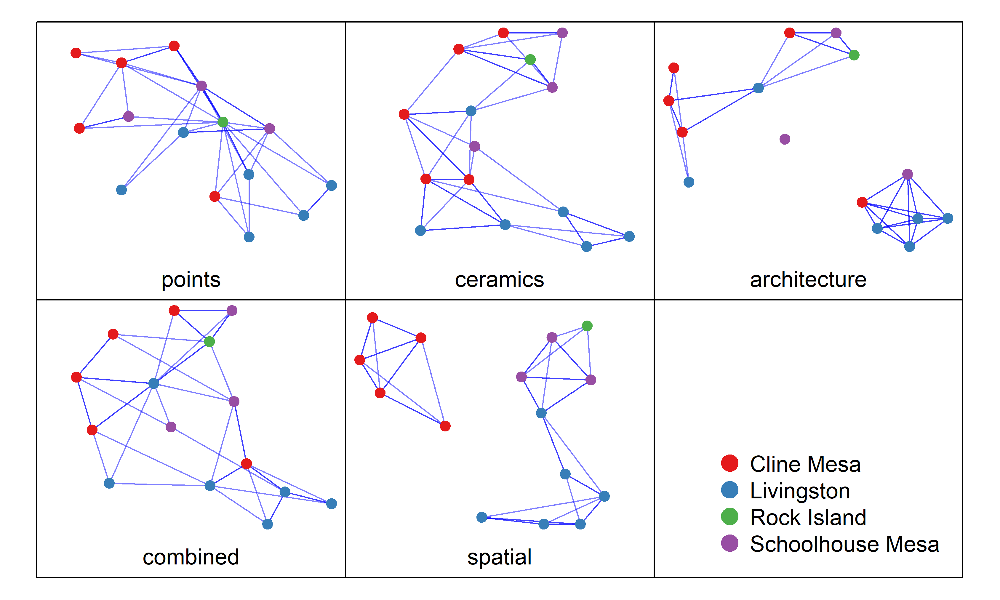
```

## Multilayer networks

::: {.columns}
::: {.column}

```{r}
m = layer_comparison_ml(net, method = "jaccard.edges", mode = "all", layers = c("points","spatial","ceramics","architecture"))
m = round(m,2)
m %>% knitr::kable()
```

:::

::: {.column}

```{r}
m = layer_comparison_ml(net, method = "rho.degree", mode = "all", layers = c("points","spatial","ceramics","architecture"))
m = round(m,2)
m %>% knitr::kable()

```


:::
:::

## Correlation

```{r}
# correlation
long = netData %>%
  select(from,to,any_of(contains("rank"))) %>%
  pivot_longer(-c(from,to,rank_spatial)) %>% 
  filter(name != "rank_combined")
nms = long$name %>% unique
corrTests = map(nms,function(n){
  x = long %>% filter(name == n) %>% distinct_all() %>% pull(rank_spatial)
  y = long %>% filter(name == n) %>% distinct_all() %>% pull(value)
  corr <- cor.test(x=x, y=y, method = 'spearman')
}) %>%
  set_names(nms)

corrDF = map_df(corrTests,function(c)tibble(rho = c$estimate,pvalue = c$p.value)) %>% 
  mutate(name = names(corrTests),.before = 1)

ggplot(long, aes(rank_spatial, value, color = name)) +
  geom_point() +
  facet_wrap(~name,scales = "free") + 
  ggthemes::theme_gdocs() + 
  guides(color = "none") 


```

## Correlation

```{r}
# correlation
long = netData %>%
  select(from,to,any_of(contains("rank"))) %>%
  pivot_longer(-c(from,to,rank_architecture)) %>% 
  filter(name != "rank_combined")
nms = long$name %>% unique
corrTests = map(nms,function(n){
  x = long %>% filter(name == n) %>% distinct_all() %>% pull(rank_architecture)
  y = long %>% filter(name == n) %>% distinct_all() %>% pull(value)
  corr <- cor.test(x=x, y=y, method = 'spearman')
}) %>%
  set_names(nms)

corrDF = map_df(corrTests,function(c)tibble(rho = c$estimate,pvalue = c$p.value)) %>% 
  mutate(name = names(corrTests),.before = 1)

ggplot(long, aes(rank_architecture, value, color = name)) +
  geom_point() +
  facet_wrap(~name,scales = "free") + 
  ggthemes::theme_gdocs() + 
  guides(color = "none") 

```

## Conclusion

::: {.columns}
::: {.column}

- Some architectural correlation
- Less spatial correlation
- Points
    - Dense network [see @Buchanan2019-vn]
    - Rock Island was highly central
    - Roomblocks were peripheral
- Ceramics 
    - Roomblocks were central
- Compounds tended to cluster together
- Platform mounds were usually central
    

:::

::: {.column}

```{r}
knitr::include_graphics("rotatingpoint.gif")
```


:::
:::

## Acknowledgements and Data

Thanks to Matt Peeples for his comments and assistance, Zach Selden for his help with EFA, Josh Watts for the use of his images [see @Watts2013-ub], Chris Caseldine and the Center for Archaeology and Society for access to collections, the cyberSW team [see @Mills2020-tb] for access to data, and the many individuals whose work made this possible.

Data availability: [](https://github.com/bischrob/SAA2022)


# Thank you and please contact me (rbischoff@asu.edu) with any questions


## References
